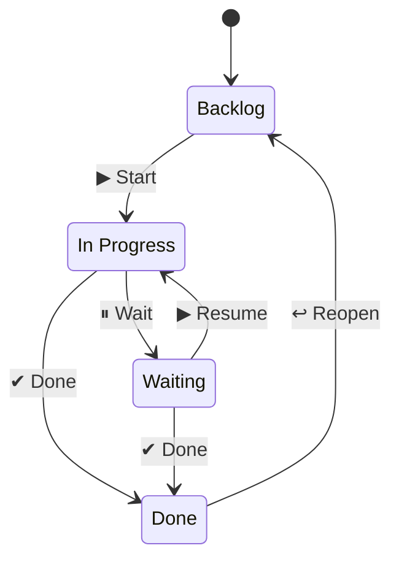

# 🗂️ Slack Kanban Board

A lightweight, production-quality Kanban board that lives entirely inside Slack. Convert any message into a task, manage it through a **Backlog → In Progress → Waiting → Done** workflow, all from your App Home tab — no external browser tab required.

---

## ✨ Features

| Feature | Detail |
|---|---|
| **Message Shortcut** | Right-click any message → *Add to Board* |
| **Personal Kanban Board** | App Home tab shows your tasks grouped by status column |
| **One-click transitions** | Start, Wait, Done, Reopen buttons on every card |
| **Deep links** | Every card links back to the original Slack message |
| **Ephemeral confirmations** | Instant feedback when tasks are created |
| **Auto-refresh** | Board refreshes after every action |
| **Delete with confirm** | Trash icon with a confirmation dialog |

---

## 🏗️ Architecture

```
src/
├── app.ts                    # Bootstrap: DB → migrations → Bolt → HTTP
├── types/
│   └── index.ts              # Domain types, DTOs, TaskStatus
├── db/
│   ├── pool.ts               # Singleton pg.Pool
│   └── migrate.ts            # Idempotent schema migrations
├── repositories/
│   └── taskRepository.ts     # Raw SQL — insertTask, findTasksByUser, etc.
├── services/
│   └── taskService.ts        # Business logic — validation, orchestration
├── slack/
│   ├── handlers.ts           # Bolt event/action/shortcut registrations
│   └── publishHome.ts        # Fetch tasks → build view → views.publish
├── views/
│   └── homeView.ts           # buildHomeView(), buildTaskCard() Block Kit builders
└── routes/
    └── health.ts             # GET /health  GET /status
```

**Stack:** Node.js 22 · TypeScript · Slack Bolt SDK (Socket Mode) · PostgreSQL 16 · Express · Docker

---

## 🚀 Quick Start — Local Development

### Prerequisites

| Tool | Version |
|---|---|
| Node.js | ≥ 22 |
| Docker + Docker Compose | any recent version |
| A Slack Workspace | with permission to install apps |

---

### Step 1 — Create the Slack App

1. Go to **https://api.slack.com/apps** → **Create New App** → **From an app manifest**
2. Choose your workspace
3. Paste the contents of **`slack-app-manifest.yml`** (switch to YAML tab)
4. Click **Create**, then **Install to Workspace** and authorise

Collect these three credentials from the Slack dashboard:

| Where to find it | Value |
|---|---|
| **Basic Information → App Credentials** | `SLACK_SIGNING_SECRET` |
| **OAuth & Permissions → Bot User OAuth Token** | `SLACK_BOT_TOKEN` (starts `xoxb-`) |
| **Basic Information → App-Level Tokens** → create one with `connections:write` scope | `SLACK_APP_TOKEN` (starts `xapp-`) |

---

### Step 2 — Configure Environment

```bash
cp .env.example .env
```

Edit `.env` and fill in the three Slack credentials:

```dotenv
SLACK_BOT_TOKEN=xoxb-...
SLACK_SIGNING_SECRET=...
SLACK_APP_TOKEN=xapp-...

# PostgreSQL (defaults work with docker compose)
POSTGRES_HOST=localhost
POSTGRES_PORT=5432
POSTGRES_DB=slack_kanban
POSTGRES_USER=postgres
POSTGRES_PASSWORD=postgres
```

---

### Step 3 — Start with Docker Compose

```bash
docker compose up --build
```

This starts:
- **PostgreSQL 16** on port `5432` (with a named volume for persistence)
- **The Kanban app** on port `3000` using Socket Mode (no public URL needed for Slack traffic)

The app will automatically run database migrations on startup.

**Verify it's running:**

```bash
curl http://localhost:3000/health
# {"status":"ok","timestamp":"..."}

curl http://localhost:3000/status
# {"status":"ok","db":"connected","timestamp":"..."}
```

---

### Step 4 — Test in Slack

1. Open Slack and find the **Kanban Board** app in your sidebar
2. Click **App Home** tab — you should see your empty board
3. Go to any channel, hover over any message, click **⋮ More actions** → **Add to Board**
4. A confirmation ephemeral will appear and your board will update
5. Click **▶ Start** to move the task to *In Progress*, **✔ Done** when complete

---

### Local dev without Docker (bare metal)

If you prefer to run Node directly:

```bash
# Start only the database
docker compose up postgres -d

# Install dependencies
npm install

# Run in watch mode
npm run dev:watch
```

---

## 📦 npm Scripts

| Script | Description |
|---|---|
| `npm run dev` | Run once with ts-node |
| `npm run dev:watch` | Hot-reload via nodemon |
| `npm run build` | Compile TypeScript → `dist/` |
| `npm run start` | Run compiled output |
| `npm run typecheck` | Type-check without emitting |
| `npm run db:migrate` | Run migrations standalone |

---

## 🐳 Docker Commands

```bash
# Start everything (production build)
docker compose up --build

# Development mode with hot-reload
docker compose -f docker-compose.yml -f docker-compose.dev.yml up --build

# Start only the database
docker compose up postgres -d

# View app logs
docker compose logs -f app

# Stop everything
docker compose down

# Stop and wipe the database volume
docker compose down -v
```

---

## 🗄️ Database Schema

```sql
CREATE TABLE tasks (
  id               UUID        PRIMARY KEY DEFAULT gen_random_uuid(),
  title            TEXT        NOT NULL,
  description      TEXT,                    -- full Slack message text
  slack_channel_id TEXT        NOT NULL,
  slack_message_ts TEXT        NOT NULL,
  slack_permalink  TEXT        NOT NULL,
  status           TEXT        NOT NULL DEFAULT 'Backlog'
                               CHECK (status IN ('Backlog','In Progress','Waiting','Done')),
  created_by       TEXT        NOT NULL,    -- Slack user ID
  created_at       TIMESTAMPTZ NOT NULL DEFAULT NOW(),
  updated_at       TIMESTAMPTZ NOT NULL DEFAULT NOW()
);
```

See **`schema.sql`** for the complete schema including indexes and the `updated_at` auto-trigger.

---

## 🔄 Task Lifecycle



| Column | Available buttons |
|---|---|
| Backlog | ▶ Start |
| In Progress | ⏸ Wait · ✔ Done |
| Waiting | ▶ Resume · ✔ Done |
| Done | ↩ Reopen |

All transitions refresh the board instantly.

---

## 🌐 HTTP Endpoints

| Endpoint | Description |
|---|---|
| `GET /health` | Liveness — always returns 200 if the process is up |
| `GET /status` | Readiness — checks PostgreSQL connectivity |

---

## 🔐 Security Notes

- **Never commit `.env`** — it's in `.gitignore`
- The Docker image runs as a non-root user (`appuser`)
- Task mutations are scoped to `created_by = :userId` — users can only modify their own tasks
- The Slack signing secret is verified on every inbound request

---

## 🧩 Extending the App

### Add a new status column

1. Add the value to `TASK_STATUSES` in `src/types/index.ts`
2. Add an entry to `STATUS_CONFIG` and `COLUMN_ACTIONS` in `src/views/homeView.ts`
3. Register the new `task_status_<Name>` action in `src/slack/handlers.ts`
4. Update the `CHECK` constraint in `schema.sql` and `migrate.ts`

### Team / shared boards

Replace the `getTasksForUser` query with a team-scoped query and add a `team_id` column to `tasks`.

### Due dates

Add a `due_date TIMESTAMPTZ` column, expose it on the task card, and add a reminder via Slack's scheduled messages API.

---

## 📄 Files Reference

| File | Purpose |
|---|---|
| `src/app.ts` | Entry point, bootstraps DB + Bolt + HTTP |
| `src/types/index.ts` | TypeScript domain types |
| `src/db/pool.ts` | Singleton `pg.Pool` |
| `src/db/migrate.ts` | Idempotent SQL migrations |
| `src/repositories/taskRepository.ts` | Data access layer |
| `src/services/taskService.ts` | Business logic |
| `src/slack/handlers.ts` | All Bolt event/action/shortcut handlers |
| `src/slack/publishHome.ts` | Renders and publishes the Home Tab |
| `src/views/homeView.ts` | Block Kit view builders |
| `src/routes/health.ts` | Express health/status routes |
| `schema.sql` | Reference SQL schema |
| `slack-app-manifest.yml` | Import directly into api.slack.com |
| `Dockerfile` | Multi-stage production image |
| `docker-compose.yml` | Production compose (app + postgres) |
| `docker-compose.dev.yml` | Development overrides (hot-reload) |
| `.env.example` | Environment variable template |

---

## 🤝 Contributing

1. Fork the repo
2. `npm install && cp .env.example .env`
3. Fill in credentials and run `docker compose up postgres -d`
4. `npm run dev:watch`
5. Open a PR with a clear description

---

*Built with ⚡ [Slack Bolt for Node.js](https://slack.dev/bolt-js/) and 🐘 PostgreSQL*
